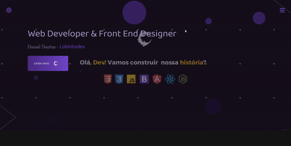
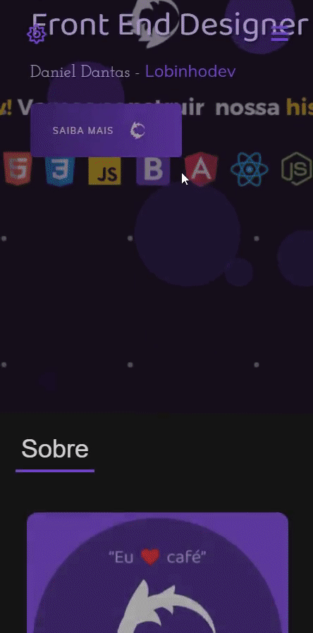

# Portfólio

## 💻 Projeto

Olá, sou lobinhodev, e aqui você encontrará meu portfólio com todos meus projetos realizados com a progressão dos meus estudos.

(<a href="#top">back to top</a>)

## 📢 Visite o site

[Portfólio](https://lobinhodev.github.io/Portfolio-lobinhodev/).

(<a href="#top">back to top</a>)

## Pré-requisitos

-   `Git`

## Indicações

-   nvm
-   Execute `nvm use` para usar a versão Node recomendada para o projeto

### Comandos

| Comando                                    | O que faz?            | Observação               |
| ------------------------------------------ | --------------------- | ------------------------ |
| `git clone https://github.com/lobinhodev/` | Clona meu repositório | **Execute no terminal!** |

### Desktop

  

### Mobile

  

## 🧠 Tecnologias

Esse projeto foi desenvolvido com as seguintes tecnologias:

-   HTML
-   CSS
-   JavaScript

(<a href="#top">back to top</a>)

Bibliotecas

-   [Google Fonts](https://fonts.google.com/)
-   [ScrollRevel](https://scrollrevealjs.org)
-   [FontAwesome](https://fontawesome.com/)
-   [Hover](https://github.com/IanLunn/Hover)

(<a href="#top">back to top</a>)

Utilitários

-   [Favicon](https://favicon.io/)
-   [UiGradient](https://uigradients.com/#CocoaaIce)
-   [CSS Wand](https://www.csswand.dev)

(<a href="#top">back to top</a>)

## Referências

-   [W3Schools referência HTML](https://www.w3schools.com/tags/default.asp)
-   [W3Schools referência CSS](https://www.w3schools.com/cssref/default.asp)
-   [Google Fonts](https://fonts.google.com/)
-   [Coolors](https://coolors.co/palettes/trending)
-   [Paletton](https://paletton.com/)
-   [W3Schools propriedades CSS no DOM](https://www.w3schools.com/jsref/dom_obj_style.asp)
-   [MDN lista de eventos](https://developer.mozilla.org/en-US/docs/Web/Events)
-   [CSS BEM](https://desenvolvimentoparaweb.com/css/bem/)

(<a href="#top">back to top</a>)

---

Feito com ♥ by Lobinhodev 🐺
